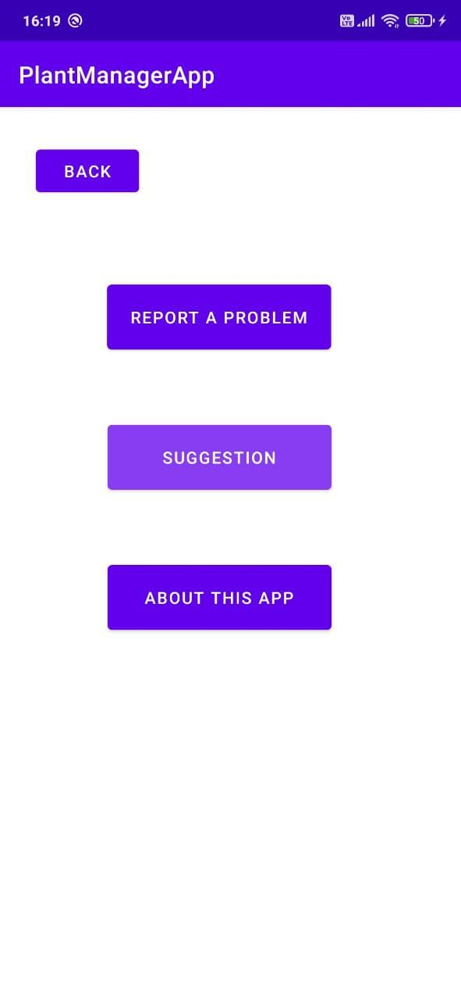

# PlantManagerApp

Приложение, которое поможет не забывать поливать, удобрять, опрыскивать и пересаживать растения.
В приложении можно добавить растение, удалить растение, посмотреть что и с каким растением нужно сделать сегодня - 
какое-то полить, какое-то пересадить, какое-то опрыскать. 
Также можно посмотреть планы по уходу за растениями в календаре на разные дни. 

